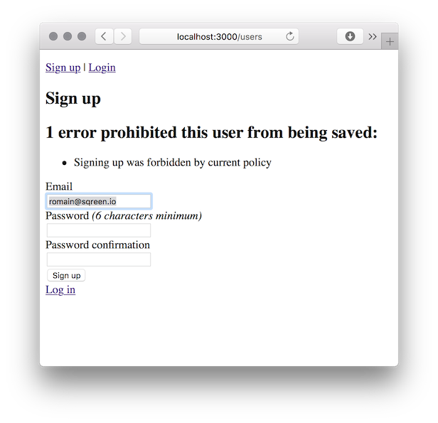
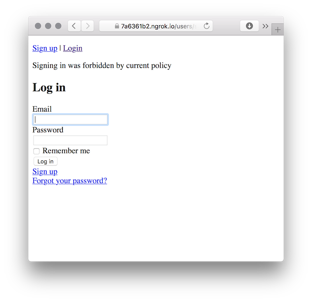

Return to [Step 0](https://github.com/sqreen/devise_sqreener_tutorial/blob/step_0/README.md)
```bash
$ git checkout step_0
```

----


# Sqreening out malicious users

In [Step 0](https://github.com/sqreen/devise_sqreener_tutorial/tree/step_0), we set up a basic Rails app, and installed `devise_sqreener`, setting it up with an API key. Now let's get to the heart of the matter, and use `devise_sqreener` to stop bad apples from using our app.

First, let's see what information we can extract from the Sqreen API.

# What the Sqreen API knows about your users.

The Sqreen API, which `devise_sqreener` users for its magic, can tell you quite a lot about an email address or an ip address. You can view the entire [Sqreen API reference](https://doc.sqreen.io/reference), but let's summarize the important bits here.

Passing an email to the Sqreen API will yield an object with the following fields:

* `email`: string The email address queried.
* `risk_score`: number The assessed risk that this email address is being used by a malevolent actor. Values range from 0 to 100. Anything greater than 80 is really bad and should be dropped; anything greater than about 40 is worth flagging and keeping an eye on.
* `is_email_harmful`: boolean Does the email address itself pose a direct security risk? E.g., does the email address contain embedded JavaScript?
* `is_known_attacker`: boolean Was this email address used as part of a security attack?
* `high_risk_security_events_count`: number The number of high-risk security events (e.g. SQL injection attacks) involving this email address.
* `security_events_count`: number The number of all security events (both high-risk and low-risk) involving this email address.
* `is_disposable`: boolean Does this email's domain belong to a known vendor of disposable, temporary, or anonymized email addresses?
* `is_email_malformed`: boolean Is the email malformed according to RFC 5322?

Likewise, passing an IP to the Sqreen API yields a similar, but not identical object:

* `ip`: string The IP address queried.
* `ip_version`: number The version of the IP address queried. Either 4 or 6.
* `risk_score`: number The assessed risk that this IP address is being used by a malevolent actor. Values range from 0 to 100. Anything greater than 80 is really bad and should be dropped; anything greater than about 40 is worth flagging and keeping an eye on.
* `is_known_attacker`: boolean Was this IP address used as part of a security attack?
* `high_risk_security_events_count`: number The number of high-risk security events (e.g. SQL injection attacks) originating from this IP address.
* `security_events_count`: number The number of all security events (both high-risk and low-risk) originating from this IP address.
* `ip_geo`: object The geographical location associated with this IP address.
* `ip_geo.latitude` number The latitude of the location.
* `ip_geo.longitude `number The longitude of the location.
* `ip_geo.country_code` string The ISO ALPHA-3 Code for the country that this location exists within. _Ex._ United States = `USA`, France = `FRA`.
* `is_datacenter`: boolean Does this IP address belong to a known datacenter, such as AWS or Google Cloud?
* `is_vpn`: boolean Does this IP address belong to a known VPN?
* `is_proxy`: boolean Does this IP address belong to a known proxy server?
* `is_tor`: boolean Is this IP address a known Tor exit point?

# Using this knowledge to gain an unfair advantage

`devise_sqreener` lets us use this knowledge of email and IP addresses to block sign-ups and sign-ins to your Rails app. Additionally, since `devise_sqreener` stores this information with the user, you can take advantage of it in other places in your app as well. First, we need to decide on a security policy.

## Choosing a Sqreening policy

"Sqreening", get it? Get it?

There are a lot of ways to skin this cat (as it were), and you'll need to decide what the right policy is for your own app. But for the purposes of this tutorial, let's suppose that we want to:

* Prevent sign-ups from anyone with an email or an IP risk score greater than 70, or with a disposable email address.
* Prevent sign-ups or sign-ins via TOR, or just because we're feeling especially malicious, from anyone in your country.

What's especially nice about this policy is that we can test it out for ourselves 🤓

## Implementing the Sqreening policy

`devise_sqreener` has two predicates that can be configured to set the Sqreening policy—by defeault they let everything pass. Basically, these two predicates are functions (really, Ruby blocks) that return `true` when a user should be blocked, and `false` when they should be allowed to pass. Open up `config/initializers/devise.rb` and add these to the bottom, just above the `end` statement. (Note: I live in France! Your country of residence will vary, so please consider that when filling out the example below.)

```ruby
  # Block signing up when: Risk scores are too high, or the email address is disposable.
  config.sqreen_block_sign_up =  -> (email, ip, user)  {
    (ip && ip['risk_score'] > 70) ||
    (email && (email['risk_score'] > 70 || email['is_disposable']) )
  }
  
  # Block signing in from TOR, and from France 
  config.sqreen_block_sign_in =  -> (email, ip, user)  {
    ip && (ip['is_tor'] || ip['ip_geo']['country_code'] == 'FRA')
  }
```

# Checking everything out.

Restart your app, and load up the page again. Go ahead and sign out, too. Let's see if we can trigger the various cases in our policy.

## Risky users

You probably don't have access to an IP address that is implicated in a high-risk security incident, but you _do_ have access to an email address that has been flagged as ultra-risky, one that belongs to the notorious cyber-criminal Romain Didry—`romain@sqreen.io`


Try creating an account with his email address `romain@sqreen.io`. It should fail, as this email address has a risk score of 100, the maximum possible.



You might also try an email address from an anonymizer like yopmail.com. Don't worry that you don't have control over the actual email address, no email confirmation is being performed in our simple demonstration app.


We can check the sign-in process too. Go ahead and create an account with your own email address. You'll need to make sure that you're connecting to your app over Tor, or from a public IP address that is geo-locatable. You might consider using `ngrok` to access your app as though it were running in the cloud, for example. If you have TOR installed, you can try signing in over TOR as well.




## Troubleshooting
If you aren't getting the expected failures, the first thing to check is whether `devise_sqreener` is getting the Sqreen API key. Make sure that it is being passed in your environment. Once you are certain that the API key is getting passed, double check the policy predicates you set up; make sure that the email address or IP address you are using really does fail the predicates as expected.

# There is no step 3

That's all there is! Our app is now blocking evil hackers like that fiendish Romain, and it is also preventing sign-ins from France and over TOR.

The next section contains the final fully operational code for you to play with and experiment with.

----

Continue to [Step 2](https://github.com/sqreen/devise_sqreener_tutorial/blob/step_2/README.md)
```bash
$ git checkout step_2
```